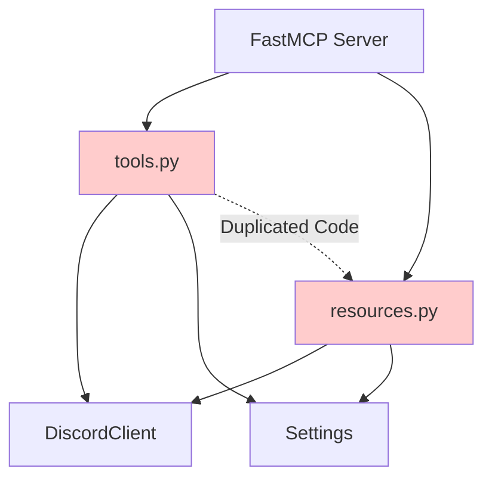
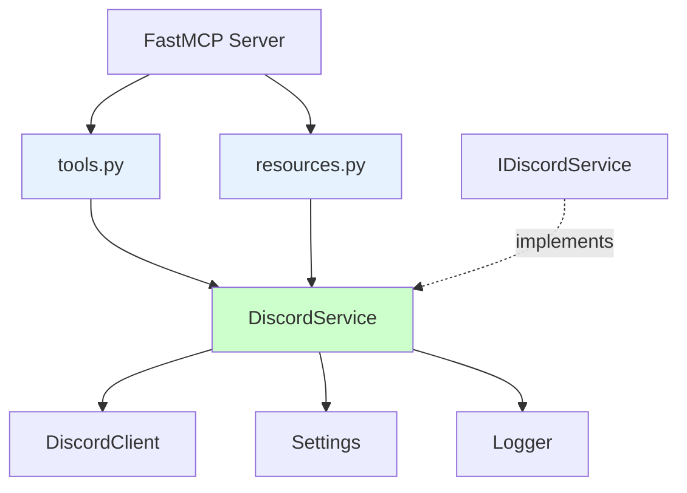

# DiscordService Refactor - Technical Planning Document

## 🎯 Vision & Strategic Goals

### Project Vision
Transform the Discord MCP server from a duplicated, tightly-coupled architecture to a clean, maintainable service-oriented design that follows industry best practices for Python backend development.

### Strategic Objectives

#### Primary Goals
- **Eliminate Technical Debt**: Remove ~298 lines of duplicated code between tools.py and resources.py
- **Improve Architecture**: Implement proper service layer separation following SOLID principles
- **Enhance Maintainability**: Create single source of truth for Discord API operations
- **Increase Testability**: Enable comprehensive mocking and unit testing of Discord operations

#### Secondary Goals
- **Future-Proof Design**: Establish foundation for easy addition of new Discord features
- **Performance Optimization**: Maintain current performance while improving code organization
- **Developer Experience**: Simplify development workflow for Discord-related features
- **Code Quality**: Achieve industry-standard architecture patterns in Python

### Success Vision
By completion, developers will be able to:
- Add new Discord features by implementing a single service method
- Test Discord operations in isolation using clean mocking interfaces
- Maintain consistent error handling and logging across all Discord operations
- Understand the codebase architecture through clear separation of concerns

---

## 🏗️ System Architecture

### Current Architecture Analysis

#### Existing Problems


**Issues:**
- Direct coupling between MCP handlers and Discord client
- Duplicated business logic in multiple layers
- No abstraction for Discord operations
- Inconsistent error handling patterns

#### Target Architecture



**Benefits:**
- Clean separation of concerns
- Single responsibility for Discord operations
- Testable service layer with interface abstraction
- Consistent error handling and logging

### Service Layer Architecture

#### Interface Design Pattern
```python
# Abstract Interface (Contract)
class IDiscordService(ABC):
    """Defines contract for Discord operations"""
    
    @abstractmethod
    async def get_guilds_formatted(self) -> str:
        """Get formatted guild list"""
        pass
    
    @abstractmethod
    async def get_channels_formatted(self, guild_id: str) -> str:
        """Get formatted channel list"""
        pass
```

#### Dependency Injection Pattern
```python
# Service Implementation
class DiscordService(IDiscordService):
    def __init__(self, 
                 discord_client: DiscordClient,
                 settings: Settings, 
                 logger: structlog.Logger):
        self._discord_client = discord_client
        self._settings = settings
        self._logger = logger
```

#### Integration Pattern
```python
# FastMCP Integration
async def lifespan(server: FastMCP):
    # Initialize dependencies
    discord_client = DiscordClient(...)
    settings = Settings(...)
    logger = structlog.get_logger()
    
    # Create service
    discord_service = DiscordService(discord_client, settings, logger)
    
    # Register in context
    server.request_context.lifespan_context["discord_service"] = discord_service
```

### Data Flow Architecture

#### Before Refactor
```
MCP Request → tools.py/resources.py → DiscordClient → Discord API
                ↓
            Direct formatting & error handling
                ↓
            Response to MCP Client
```

#### After Refactor
```
MCP Request → tools.py/resources.py → DiscordService → DiscordClient → Discord API
                                          ↓
                                   Centralized formatting
                                   Centralized error handling
                                   Centralized logging
                                          ↓
                                   Response to MCP Client
```

### Error Handling Architecture

#### Centralized Error Management
```python
class DiscordService:
    def _handle_discord_error(self, error: DiscordAPIError, operation: str) -> str:
        """Centralized error handling with consistent formatting"""
        error_msg = f"Discord API error during {operation}: {str(error)}"
        self._logger.error("Discord operation failed", 
                          operation=operation, 
                          error=str(error),
                          status_code=getattr(error, 'status_code', None))
        return f"# Error\n\n{error_msg}"
```

#### Permission Validation Architecture
```python
class DiscordService:
    def _validate_permissions(self, guild_id: str = None, channel_id: str = None) -> bool:
        """Centralized permission checking"""
        if guild_id and not self._settings.is_guild_allowed(guild_id):
            return False
        if channel_id and not self._settings.is_channel_allowed(channel_id):
            return False
        return True
```

---

## 💻 Technology Stack

### Core Technologies

#### Python Ecosystem
- **Python Version**: 3.8+ (maintaining current compatibility)
- **Async Framework**: asyncio (native Python async/await)
- **Type System**: Python type hints with typing module

#### MCP Framework
- **FastMCP**: Model Context Protocol server framework
  - Version: Current project version
  - Role: HTTP/stdio transport and request handling
  - Integration: Lifespan context management

#### Discord Integration
- **Discord API**: REST API v10
- **HTTP Client**: aiohttp (via DiscordClient)
- **Authentication**: Discord Bot Token

#### Development Tools
- **Testing**: pytest + pytest-asyncio
- **Code Quality**: black, isort, mypy
- **Logging**: structlog (structured logging)

### Architecture Patterns

#### Design Patterns
- **Service Layer Pattern**: Centralized business logic
- **Dependency Injection**: Constructor injection for testability
- **Interface Segregation**: Abstract base classes for contracts
- **Single Responsibility**: Each class has one reason to change

#### Python-Specific Patterns
- **Abstract Base Classes**: Using `abc.ABC` for interface definition
- **Context Managers**: Proper resource management
- **Async/Await**: Native Python async programming
- **Type Hints**: Full type annotation for IDE support and validation

### Testing Architecture

#### Testing Framework Stack
```yaml
testing_stack:
  unit_testing:
    framework: "pytest"
    async_support: "pytest-asyncio"
    mocking: "unittest.mock + pytest-mock"
    coverage: "pytest-cov"
  
  integration_testing:
    framework: "pytest"
    fixtures: "pytest fixtures for service setup"
    mocking: "Mock DiscordClient for integration tests"
  
  quality_assurance:
    type_checking: "mypy"
    code_formatting: "black + isort"
    linting: "flake8 (if configured)"
```

#### Mock Architecture
```python
# Service Mocking Strategy
@pytest.fixture
async def mock_discord_service():
    service = Mock(spec=IDiscordService)
    service.get_guilds_formatted.return_value = "# Mock Guilds\n..."
    return service

# Integration Test Pattern
async def test_list_guilds_tool(mock_discord_service):
    # Inject mock service into context
    context["discord_service"] = mock_discord_service
    
    # Test tool behavior
    result = await list_guilds()
    
    # Verify service was called
    mock_discord_service.get_guilds_formatted.assert_called_once()
```

---

## 🛠️ Required Tools & Environment

### Development Environment

#### Essential Tools
```yaml
development_tools:
  code_editor:
    primary: "VS Code / PyCharm / Any Python IDE"
    extensions: 
      - "Python extension"
      - "Type checking support"
      - "Git integration"
  
  python_environment:
    version: "Python 3.8+"
    virtual_env: "venv (existing project venv)"
    package_manager: "pip"
  
  version_control:
    system: "Git"
    repository: "Existing Discord-MCP repository"
    branching: "Feature branch for refactor"
```

#### Development Dependencies
```bash
# Already available in project
pip install pytest pytest-asyncio pytest-cov
pip install black isort mypy
pip install structlog
pip install fastmcp
```

### Testing Tools

#### Unit Testing Setup
```yaml
testing_environment:
  test_runner: "pytest"
  async_testing: "pytest-asyncio"
  mocking: "unittest.mock (Python standard library)"
  coverage: "pytest-cov"
  
  test_structure:
    unit_tests: "tests/services/test_discord_service.py"
    integration_tests: "tests/test_tools.py, tests/test_resources.py"
    fixtures: "tests/conftest.py"
```

#### Quality Assurance Tools
```bash
# Code formatting
black src/ tests/
isort src/ tests/

# Type checking
mypy src/

# Test execution
pytest tests/ --cov=src/discord_mcp --cov-report=html

# Integration testing
python test_all_tools.py
```

### Development Workflow Tools

#### Git Workflow
```bash
# Feature branch creation
git checkout -b feature/discord-service-refactor

# Development cycle
git add .
git commit -m "feat(services): implement DiscordService interface"

# Testing before push
pytest tests/
black --check src/ tests/
mypy src/

# Push and PR
git push origin feature/discord-service-refactor
```

#### IDE Configuration

#### VS Code Settings
```json
{
  "python.defaultInterpreterPath": "./venv/bin/python",
  "python.testing.pytestEnabled": true,
  "python.testing.pytestArgs": ["tests/"],
  "python.linting.mypyEnabled": true,
  "python.formatting.provider": "black",
  "[python]": {
    "editor.formatOnSave": true,
    "editor.codeActionsOnSave": {
      "source.organizeImports": true
    }
  }
}
```

### Monitoring & Debugging Tools

#### Development Debugging
```yaml
debugging_tools:
  logging:
    framework: "structlog"
    level: "DEBUG during development"
    format: "JSON for structured analysis"
  
  profiling:
    tool: "Python cProfile (if performance issues)"
    memory: "memory_profiler (if needed)"
  
  api_testing:
    tool: "Manual testing with existing Discord bot"
    validation: "Compare before/after behavior"
```

#### Performance Monitoring
```python
# Performance validation approach
import time
import asyncio

async def benchmark_service_method():
    start_time = time.time()
    result = await discord_service.get_guilds_formatted()
    end_time = time.time()
    
    print(f"Service method took: {end_time - start_time:.3f}s")
    return result
```

---

## 📋 Implementation Checklist

### Pre-Implementation Setup

#### Environment Preparation
- [ ] **Virtual Environment**: Activate existing project venv
- [ ] **Dependencies**: Verify all required packages installed
- [ ] **Git Branch**: Create feature branch `feature/discord-service-refactor`
- [ ] **IDE Setup**: Configure Python path and testing framework
- [ ] **Baseline Tests**: Run existing test suite to ensure clean starting point

#### Code Analysis
- [ ] **Current State**: Document exact lines of duplicated code
- [ ] **API Surface**: Identify all public methods that must remain unchanged
- [ ] **Dependencies**: Map all current Discord client usage patterns
- [ ] **Error Patterns**: Catalog existing error handling approaches

### Development Phase Checklist

#### Phase 1: Service Foundation
- [ ] **Package Structure**: Create `src/discord_mcp/services/` package
- [ ] **Interface Definition**: Implement `IDiscordService` abstract base class
- [ ] **Service Implementation**: Create `DiscordService` concrete class
- [ ] **Error Handling**: Implement centralized error management
- [ ] **Unit Tests**: Write comprehensive service tests (95%+ coverage)
- [ ] **Integration Setup**: Update server.py for service registration

#### Phase 2: Tools Refactor
- [ ] **Method Migration**: Replace direct client calls with service calls
- [ ] **API Preservation**: Ensure identical method signatures
- [ ] **Behavior Validation**: Confirm identical output formatting
- [ ] **Test Updates**: Update tool tests to mock DiscordService
- [ ] **Integration Testing**: Verify tools work with service

#### Phase 3: Resources Refactor
- [ ] **Method Migration**: Replace direct client calls with service calls
- [ ] **API Preservation**: Ensure identical resource URIs and responses
- [ ] **Behavior Validation**: Confirm identical output formatting
- [ ] **Test Updates**: Update resource tests to mock DiscordService
- [ ] **Integration Testing**: Verify resources work with service

#### Phase 4: Validation & Cleanup
- [ ] **Code Removal**: Delete all duplicated code
- [ ] **Documentation**: Update README and inline documentation
- [ ] **Performance Testing**: Validate no regression in response times
- [ ] **End-to-End Testing**: Run full integration test suite
- [ ] **Code Review**: Peer review of all changes

### Quality Gates

#### Code Quality Checks
```bash
# Must pass before each commit
black --check src/ tests/
isort --check-only src/ tests/
mypy src/
pytest tests/ --cov=src/discord_mcp --cov-report=term-missing
```

#### Integration Validation
```bash
# Must pass before PR
python test_all_tools.py
python test_mcp_integration.py

# Performance validation
python -m pytest tests/ --benchmark-only  # if benchmarks exist
```

#### Documentation Requirements
- [ ] **Service Documentation**: Comprehensive docstrings for all methods
- [ ] **Architecture Documentation**: Update README with service layer info
- [ ] **Migration Notes**: Document changes for future developers
- [ ] **API Documentation**: Verify no changes to public APIs

---

## 🎯 Success Metrics & KPIs

### Quantitative Metrics

#### Code Quality Metrics
```yaml
code_metrics:
  duplication_reduction:
    target: "60%+ reduction in duplicated lines"
    measurement: "Line count before/after in tools.py and resources.py"
  
  test_coverage:
    target: "90%+ coverage maintained"
    measurement: "pytest-cov coverage report"
  
  cyclomatic_complexity:
    target: "< 10 per method"
    measurement: "Code analysis tools"
  
  type_coverage:
    target: "100% type hints on service methods"
    measurement: "mypy validation"
```

#### Performance Metrics
```yaml
performance_metrics:
  response_time:
    target: "No degradation (< 5% variance)"
    measurement: "Before/after API response timing"
  
  memory_usage:
    target: "< 5MB additional memory"
    measurement: "Service instantiation overhead"
  
  startup_time:
    target: "No significant impact"
    measurement: "Server startup timing"
```

### Qualitative Metrics

#### Developer Experience
- **Maintainability**: Single location for Discord logic changes
- **Testability**: Easy mocking of Discord operations
- **Readability**: Clear separation of concerns
- **Extensibility**: Simple addition of new Discord features

#### Architecture Quality
- **SOLID Principles**: Adherence to single responsibility, dependency inversion
- **Design Patterns**: Proper implementation of service layer pattern
- **Error Handling**: Consistent error management across all operations
- **Logging**: Structured, contextual logging for debugging

### Validation Criteria

#### Technical Validation
```python
# Example validation tests
async def test_service_reduces_duplication():
    """Verify no duplicated code between tools and resources"""
    tools_code = get_file_content("src/discord_mcp/tools.py")
    resources_code = get_file_content("src/discord_mcp/resources.py")
    
    # Should have no shared Discord API logic
    assert not has_duplicated_discord_logic(tools_code, resources_code)

async def test_service_maintains_api_compatibility():
    """Verify all existing APIs work identically"""
    # Test each tool and resource method
    for method in get_public_methods():
        old_result = await call_original_method(method)
        new_result = await call_refactored_method(method)
        assert old_result == new_result
```

#### Business Validation
- **Feature Parity**: All existing functionality works identically
- **Performance Parity**: No degradation in user experience
- **Reliability**: Error handling is more consistent and robust
- **Maintainability**: Future Discord features require less development time

---

## 🚀 Deployment & Rollout Strategy

### Development Deployment

#### Local Development
```bash
# Development workflow
git checkout feature/discord-service-refactor
source venv/bin/activate

# Development cycle
python -m pytest tests/services/  # Test service in isolation
python -m pytest tests/           # Full test suite
python discord_server.py --transport sse --port 8000  # Local testing
```

#### Integration Testing
```bash
# Test with real Discord bot (development environment)
export DISCORD_BOT_TOKEN="dev_bot_token"
export LOG_LEVEL="DEBUG"
python discord_server.py --transport sse --port 8000

# Validate all operations work identically
curl -X POST http://localhost:8000/tools/list_guilds
```

### Production Considerations

#### Backward Compatibility
- **Zero Breaking Changes**: All existing MCP clients continue to work
- **API Stability**: No changes to tool or resource interfaces
- **Configuration**: No changes to environment variables or settings

#### Rollback Strategy
```bash
# If issues arise, immediate rollback
git checkout main
# Restart services with original code
# All functionality returns to previous state
```

#### Monitoring Post-Deployment
- **Error Rates**: Monitor for any increase in Discord API errors
- **Response Times**: Validate performance remains consistent
- **Memory Usage**: Monitor for any memory leaks in service
- **Log Analysis**: Review structured logs for any issues

---

## 📚 References & Resources

### Technical Documentation
- **FastMCP Documentation**: Model Context Protocol server framework
- **Discord API Documentation**: REST API v10 reference
- **Python asyncio**: Asynchronous programming patterns
- **pytest Documentation**: Testing framework and best practices

### Architecture Patterns
- **Service Layer Pattern**: Martin Fowler's Enterprise Application Architecture
- **Dependency Injection in Python**: Clean Architecture principles
- **SOLID Principles**: Object-oriented design principles
- **Clean Code**: Robert Martin's clean code practices

### Python Best Practices
- **PEP 8**: Python style guide
- **Type Hints**: PEP 484 and typing module
- **Abstract Base Classes**: PEP 3119 and abc module
- **Async/Await**: PEP 492 coroutines and async syntax

### Testing Resources
- **pytest Best Practices**: Effective Python testing
- **Mock Patterns**: unittest.mock and testing strategies
- **Test-Driven Development**: TDD principles for Python
- **Integration Testing**: Testing async services and APIs

---

**Document Version**: 1.0  
**Created**: 2025-08-07  
**Author**: AI Assistant  
**Status**: Ready for Implementation  
**Estimated Duration**: 1-2 days  
**Complexity**: Moderate  

---

*This planning document provides comprehensive technical guidance for implementing the DiscordService refactor while maintaining high code quality and system reliability.*
